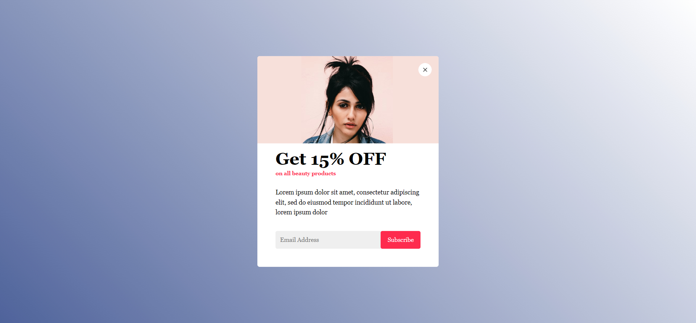

# Sacode Coding Dasar I Tugas Day 12
How To Make Mouse Leave Popup Or Modal Box using HTML CSS And JavaScript

## Link Demo Di GitHub Pages 

Silahkan lihat melalui link berikut ini :
https://yohanesaragae.github.io/sacode-coding-dasar-i-tugas-day12/

## Screenshot Hasil Tugas Day 12

Berikut ini merupakan hasil Tugas Day 12 :

